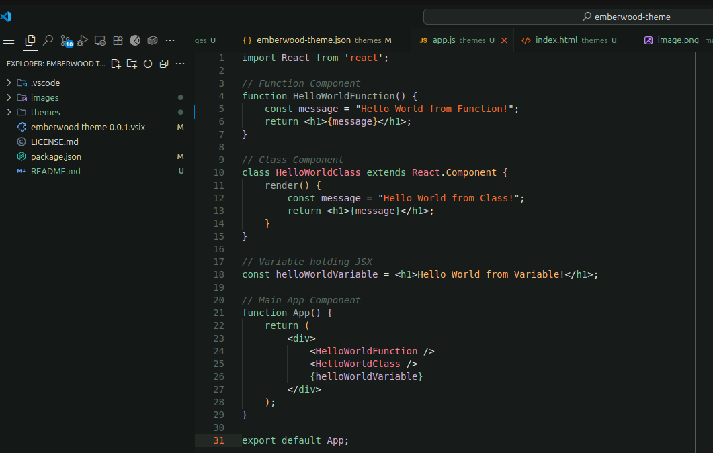
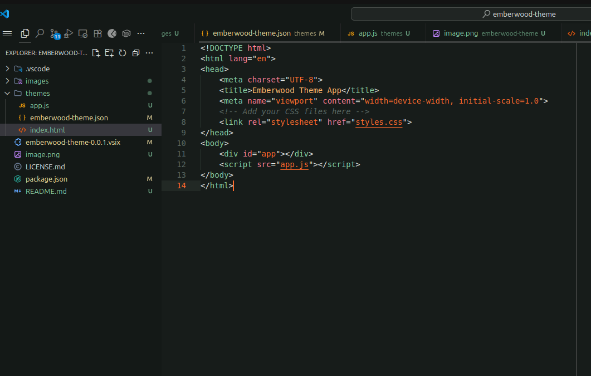

<p align="center">
  
</p>

# Emberwood

A minimalist dark theme of deep woods and ember-lit syntax.





## Features

- Deep green-black background
- Lively orange and soft pastel highlights
- Custom syntax for HTML, JS, Python, Markdown

## Installation

Search for "Emberwood" in the Extensions Marketplace or install with:

```bash
code --install-extension seu_publisher.emberwood-theme
```
